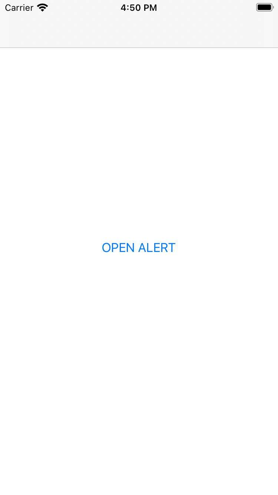
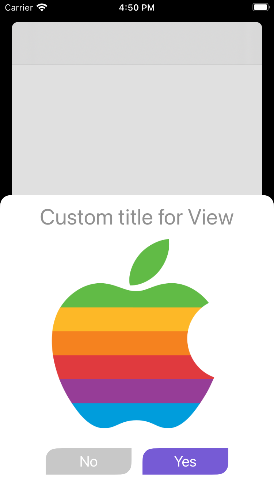
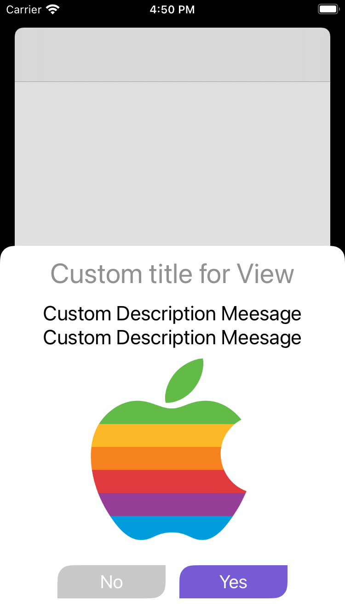
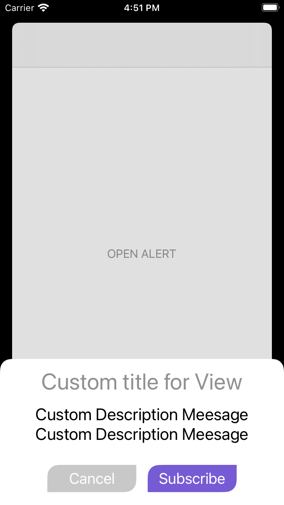

<h1>Introduction</h1>
INTUZ is presenting a Custom Alert View is used in Native iOS-based application. Custom alert view is simple component to use for if you want to add customizable alert view with image logo, header text and description. You can hide/show your description text and image logo as per the requireement. 

<br/><br/>
<h1>Features</h1>

- Easy to implement.
- Fully customizable component.
- Costomize as per your reqiurement like Alert view or Popup view

<br/><br/>

<table>
  <tr>
    <td></td>
    <td></td>
    <td></td>
    <td></td>
  </tr>
 </table>
 
 <h1>Getting Started</h1>

 To use this component in your project you need to perform the below steps:

 > Steps to Integrate
 1) Add `CustomAlertVC.swift` and `CustomAlertVC.xib` at the required place on your code.
 
 2) Add below code where you want to Integrate "Alert View" feature in the controller:
 
 *You have to add `clickOpenPopUp()` function in your view controller with button click event
 This function will open the ew popup or alert view. Also there is a callback block is implemented for action that you want to implement on call back action. 
 
 ```
    @IBAction func clickOpenPopUp(_ sender : UIButton) {
         let msgPopup : CustomAlertVC = CustomAlertVC.init(nibName: "CustomAlertVC", bundle: nil)
         msgPopup.selectOption = 2
         self.navigationController?.presentVC(msgPopup)
         
         msgPopup.callbackSelectedOption = {(indexID) -> Void in
             if indexID == 1 {
                 print("YES Clicked")
             }
             else {
                 print("NO Clicked")
             }
         }
     }
 ``` 
 
 **Note:** Make sure that the extension which is used in this component has been added to your project.
 
 <br/><br/>
 **<h1>Bugs and Feedback</h1>**
 For bugs, questions and discussions please use the Github Issues.


<br/><br/>
**<h1>License</h1>**
The MIT License (MIT)
<br/><br/>
Copyright (c) 2020 INTUZ
<br/><br/>
Permission is hereby granted, free of charge, to any person obtaining a copy of this software and associated documentation files (the "Software"), to deal in the Software without restriction, including without limitation the rights to use, copy, modify, merge, publish, distribute, sublicense, and/or sell copies of the Software, and to permit persons to whom the Software is furnished to do so, subject to the following conditions: 
<br/><br/>
THE SOFTWARE IS PROVIDED "AS IS", WITHOUT WARRANTY OF ANY KIND, EXPRESS OR IMPLIED, INCLUDING BUT NOT LIMITED TO THE WARRANTIES OF MERCHANTABILITY, FITNESS FOR A PARTICULAR PURPOSE AND NONINFRINGEMENT. IN NO EVENT SHALL THE AUTHORS OR COPYRIGHT HOLDERS BE LIABLE FOR ANY CLAIM, DAMAGES OR OTHER LIABILITY, WHETHER IN AN ACTION OF CONTRACT, TORT OR OTHERWISE, ARISING FROM, OUT OF OR IN CONNECTION WITH THE SOFTWARE OR THE USE OR OTHER DEALINGS IN THE SOFTWARE.

<br/>
<h1></h1>
<a href="https://www.intuz.com/" target="_blank"></a>


